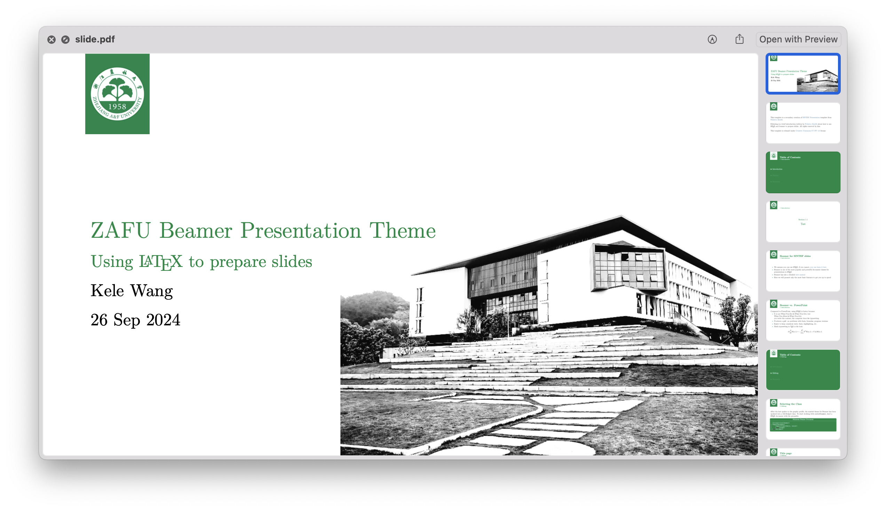
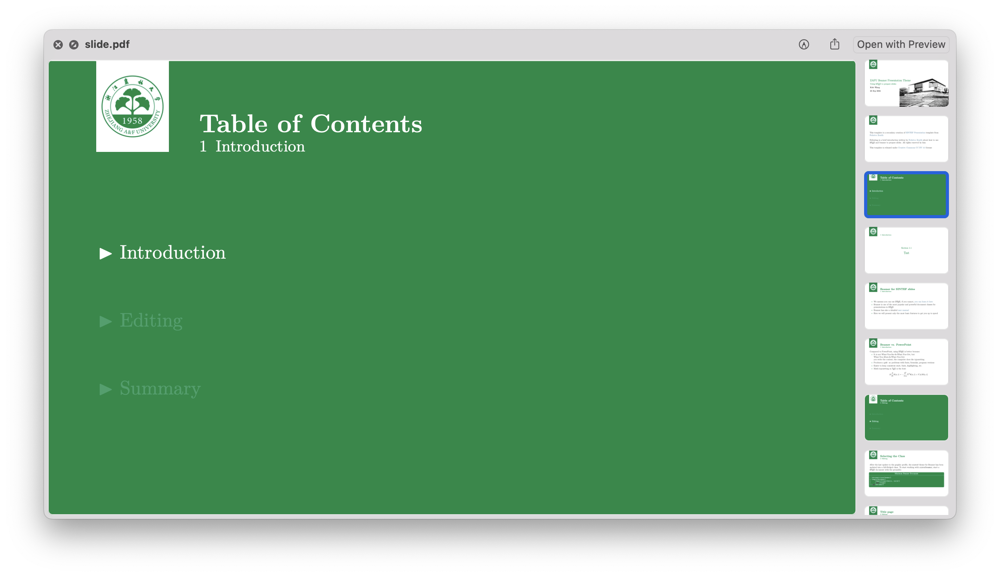
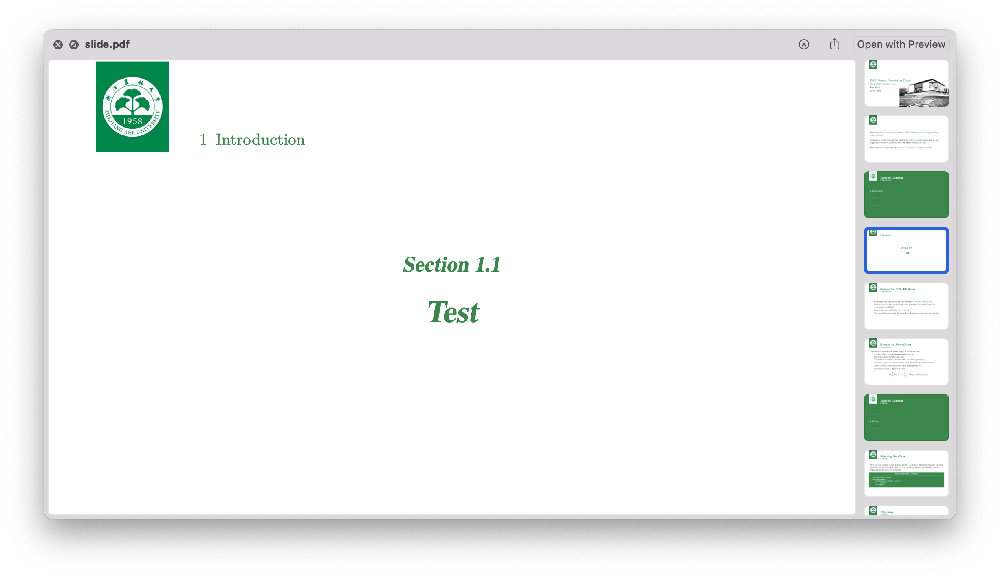
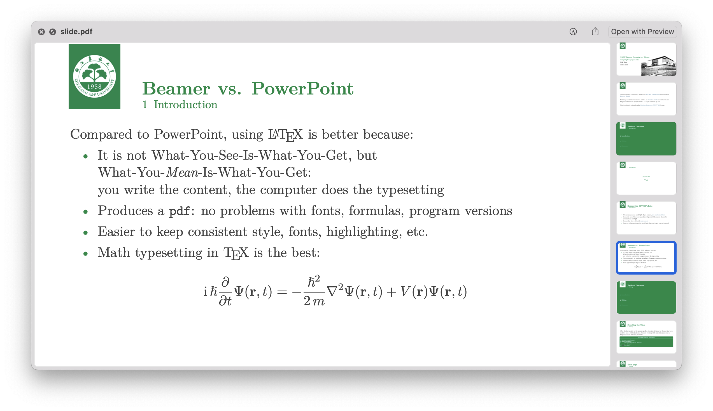
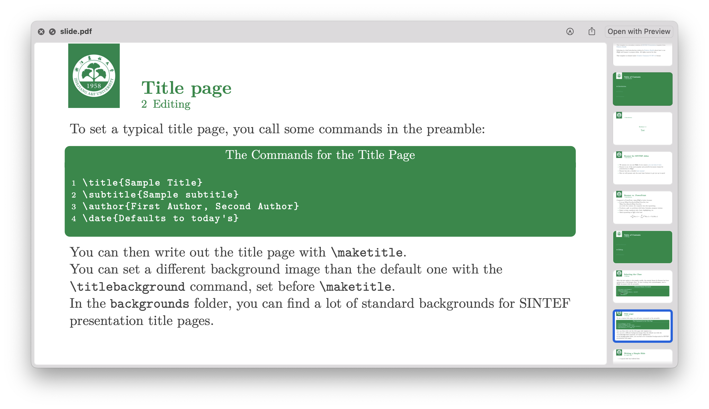
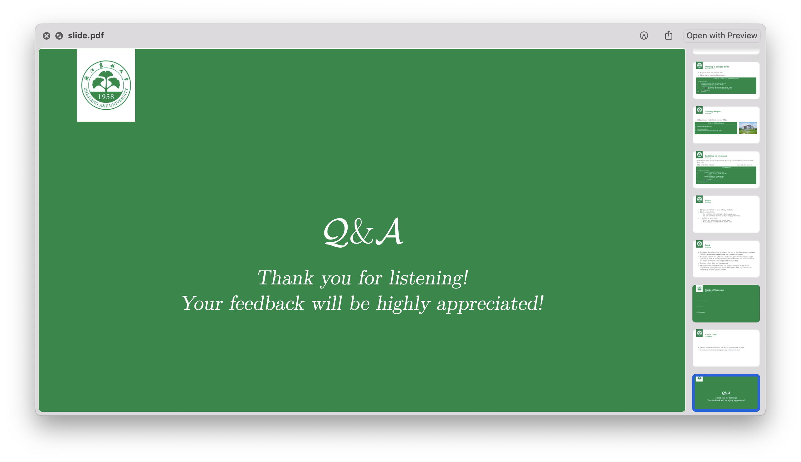

# `ZAFU Beamer Theme(Beta)`

Project modified from [liu-qilong
/
college-beamer](https://github.com/liu-qilong/college-beamer)


## Options & usage

### Switch language

To switch the language, just change the language option in the `collegeBeamer` package. For example, to switch to the Chinese language, add `zh` to the package:

```
\usepackage[zh]{collegeBeamer}
```

> When select `zh`, please add the `xeCJK`package to the preamble and use [XeLaTeX](https://www.overleaf.com/learn/latex/XeLaTeX) as the typesetting engine.

```
\usepackage{xeCJK}
```

### Page elements
- Cover

- Table of Contents

  At the beginning of each section, the table of contents will be shown with the current chapter highlighted.

- Sub-section page

- Math equation

- Code block

- End page


## Add your own college?

Refer to original project: [liu-qilong
/
college-beamer](https://github.com/liu-qilong/college-beamer)
